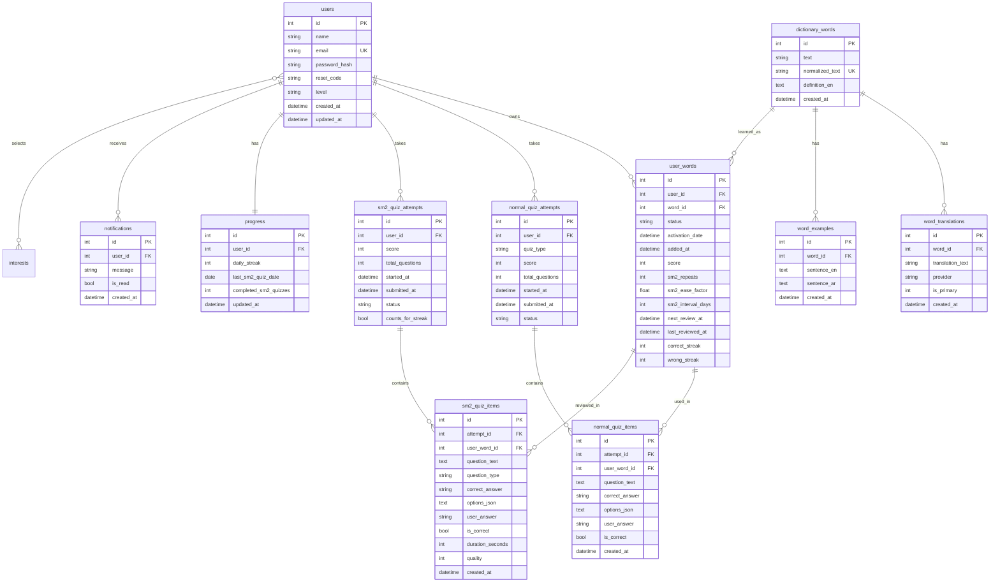

# AI VocabGen Clean ERD + SM2 Redesign

This redesign keeps the old normal quizzes and adds a third independent quiz type: **SM2 Review Quiz**. The old duplicated tables were removed from the model import path, and the database must be recreated cleanly.

## Final tables only

The backend should create only these tables:

1. `users`
2. `interests`
3. `user_interests`
4. `dictionary_words`
5. `word_translations`
6. `word_examples`
7. `user_words`
8. `normal_quiz_attempts`
9. `normal_quiz_items`
10. `sm2_quiz_attempts`
11. `sm2_quiz_items`
12. `progress`
13. `notifications`

Removed/deprecated tables that must not exist in a fresh database:

- `words`
- `sentences`
- `quizzes`
- `questions`
- `quiz_words`
- `legacy_quiz_words`
- `legacy_sentences`
- `sm2_quizzes`

## Table summary

### users
- id PK
- name
- email UNIQUE
- password_hash
- reset_code
- level
- created_at
- updated_at

### dictionary_words
Global word data shared by all users.
- id PK
- text
- normalized_text UNIQUE
- definition_en
- created_at

### word_translations
Arabic meaning from the instant translation service.
- id PK
- word_id FK -> dictionary_words.id
- translation_text
- provider
- is_primary
- created_at

### word_examples
Example sentence saved with the word.
- id PK
- word_id FK -> dictionary_words.id
- sentence_en
- sentence_ar
- created_at

### user_words
User-specific learning and SM2 state.
- id PK
- user_id FK -> users.id
- word_id FK -> dictionary_words.id
- status: pending, new, learning, review, hard, mastered
- activation_date
- added_at
- score
- sm2_repeats
- sm2_ease_factor
- sm2_interval_days
- next_review_at
- last_reviewed_at
- correct_streak
- wrong_streak

Unique: `(user_id, word_id)`.

### normal_quiz_attempts
Old/normal quizzes remain here and do not update SM2.
- id PK
- user_id FK -> users.id
- quiz_type
- score
- total_questions
- started_at
- submitted_at
- status

### normal_quiz_items
Optional details for normal quizzes.
- id PK
- attempt_id FK -> normal_quiz_attempts.id
- user_word_id FK -> user_words.id
- question_text
- correct_answer
- options_json
- user_answer
- is_correct
- created_at

### sm2_quiz_attempts
Third independent quiz type.
- id PK
- user_id FK -> users.id
- score
- total_questions
- started_at
- submitted_at
- status
- counts_for_streak

### sm2_quiz_items
Question rows for the SM2 Review Quiz.
- id PK
- attempt_id FK -> sm2_quiz_attempts.id
- user_word_id FK -> user_words.id
- question_text
- question_type
- correct_answer
- options_json
- user_answer
- is_correct
- duration_seconds
- quality
- created_at

The correct answer is not sent to Flutter when starting a quiz. It stays backend-side for submit validation.

### progress
- id PK
- user_id FK -> users.id UNIQUE
- daily_streak
- last_sm2_quiz_date
- completed_sm2_quizzes
- updated_at

Counts such as active words, mastered words, and due reviews are calculated dynamically from `user_words`, not stored redundantly.

### interests
- id PK
- name
- created_at

### user_interests
- user_id FK -> users.id
- interest_id FK -> interests.id

### notifications
- id PK
- user_id FK -> users.id
- message
- is_read
- created_at

## Mermaid ERD

